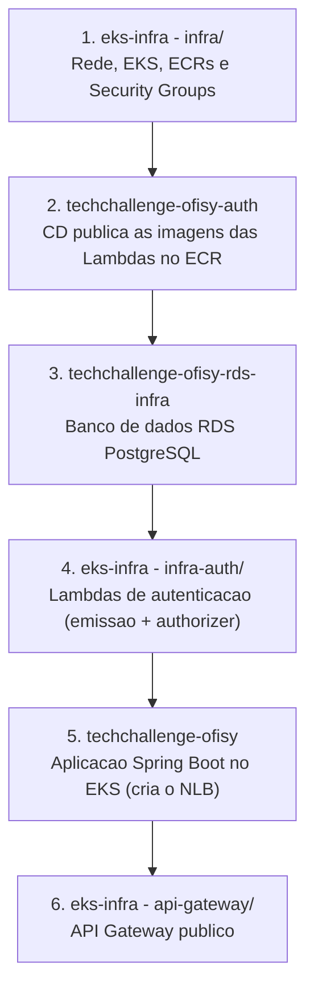

# Tech Challenge - Infraestrutura Kubernetes (AWS EKS & Redes via Terraform)

Repositório dedicado ao provisionamento infraestrutural base da aplicação **Ofisy** na AWS para a **Fase 3 do Tech Challenge SOAT (FIAP)**, englobando a rede (VPC, Subnets, Internet Gateway, NAT Gateway), o cluster Kubernetes (AWS EKS), os repositórios de imagens Docker (AWS ECR), as funções **AWS Lambda de autenticação de clientes** (emissão de token e validação) e o **API Gateway** público da aplicação.

O repositório contém **três camadas independentes**, cada uma com seu próprio state do Terraform:

| Diretório | State | Conteúdo |
| :--- | :--- | :--- |
| `infra/` | `eks/terraform.tfstate` | Rede, EKS, ECRs e Security Groups |
| `infra-auth/` | `auth/terraform.tfstate` | Lambdas de autenticação de clientes (emissão de token e authorizer) |
| `api-gateway/` | `api-gateway/terraform.tfstate` | API Gateway público, integrado às Lambdas e ao NLB da aplicação |

A separação entre `infra/` e `infra-auth/` existe porque a Lambda depende do RDS, que é provisionado em [outro repositório](https://github.com/15SOAT-FIAP/techchallenge-ofisy-rds-infra), e esse repo depende da rede criada aqui - manter tudo em um único state fecharia um ciclo entre os dois repositórios, impossibilitando o provisionamento a partir de uma conta vazia.

O `api-gateway/` é uma terceira camada, separada das outras duas, porque ele depende do **NLB da aplicação** (repositório `techchallenge-ofisy`), que só existe depois que o app já foi deployado no cluster - ou seja, depois de tudo o mais.

---

## Propósito do Repositório

Isolar e automatizar o provisionamento da infraestrutura de computação em nuvem necessária para suportar a aplicação principal e o banco de dados relacional, além de expor publicamente essa aplicação através de um **API Gateway** que protege, com autenticação via CPF/CNPJ, a rota de consulta de status de ordem de serviço.

---

## Tecnologias Utilizadas

- **Terraform (`>= 1.5.0`)**: Infraestrutura como Código (IaC).
- **AWS EKS (Elastic Kubernetes Service)**: Cluster Kubernetes gerenciado.
- **AWS VPC & Networking**: Subnets públicas/privadas, Internet Gateway, NAT Gateway e Tabela de Roteamento.
- **AWS ECR (Elastic Container Registry)**: Registros privados de imagens de container - `ofisy-ecr` (aplicação), `ofisy-auth` (Lambda de emissão de token) e `ofisy-auth-authorizer` (Lambda Authorizer).
- **AWS Lambda**: Duas funções, empacotadas como imagem de container `arm64`. A de emissão de token roda dentro da VPC (consulta o Postgres); a Authorizer roda fora da VPC (só valida assinatura e expiração do token, sem acessar banco).
- **AWS API Gateway (HTTP API)**: Porta de entrada pública da aplicação - expõe `POST /auth/customers` e repassa as demais rotas para o EKS.
- **AWS Lambda Authorizer**: valida o token JWT (HS256) na rota protegida do Gateway. Necessário porque o JWT Authorizer nativo do API Gateway só verifica assinatura assimétrica via JWKS, e este token usa segredo simétrico.
- **AWS IAM**: Gerenciamento de papéis de execução para cluster, worker nodes e Lambdas (compatível com AWS Academy / `LabRole`).
- **GitHub Actions**: Pipeline automatizada de CI/CD para deploy e destruição da infraestrutura.

---

## Arquitetura de Rede e EKS

```text
AWS Cloud (us-east-1)
 └── VPC (10.0.0.0/16)
      ├── Internet Gateway (IGW) & NAT Gateway (com Elastic IP)
      ├── Subnet Pública A (10.0.1.0/24 - us-east-1a) ── [ALB Load Balancer / Ingress]
      ├── Subnet Pública B (10.0.4.0/24 - us-east-1b) ── [ALB Load Balancer / Ingress]
      ├── Subnet Privada A (10.0.2.0/24 - us-east-1a) ── [EKS Worker Nodes / Pods / Lambda de auth]
      └── Subnet Privada B (10.0.3.0/24 - us-east-1b) ── [EKS Worker Nodes / Pods / Lambda de auth]
```

A Lambda Authorizer não aparece nesse diagrama porque não roda dentro da VPC.

---

## Ordem de Execução entre os Repositórios

A infraestrutura da Fase 3 está distribuída em quatro repositórios que se conectam por **Data Sources** (busca por tag ou por nome) ou por **variáveis passadas manualmente** - como o DNS do NLB, que muda a cada deploy da aplicação e não tem uma tag fixa pra buscar. Nunca por referência direta de recurso (remote state). Isso significa que a ordem abaixo precisa ser respeitada: cada etapa só encontra o que a anterior criou.



Cada etapa só pode rodar depois que a anterior terminou. A tabela abaixo detalha o que precisa existir em cada uma:

| Etapa | Precisa que já exista |
| :--- | :--- |
| **1** | Nada além da conta AWS e dos secrets configurados |
| **2** | Os repositórios ECR `ofisy-auth` e `ofisy-auth-authorizer`, vazios, criados na etapa 1 |
| **3** | VPC, subnets privadas e Security Groups da etapa 1 |
| **4** | O banco da etapa 3, as imagens da etapa 2 e os Security Groups da etapa 1 |
| **5** | O cluster EKS e o ECR da etapa 1, e o banco da etapa 3 |
| **6** | As duas funções Lambda da etapa 4 e o NLB criado na etapa 5 |

As etapas **2 e 3 não dependem uma da outra** - podem ser invertidas ou executadas em paralelo, desde que ambas terminem antes da etapa 4. Dentro da etapa 2, publicar as duas imagens (emissão de token e authorizer) também não tem ordem entre si.

Para **destruir**, percorra o caminho inverso: 6 → 5 → 4 → 3 → 1. Destruir a rede antes das Lambdas deixa recursos órfãos, porque as ENIs da Lambda de emissão de token ficam presas às subnets. Destrua o Gateway antes das Lambdas para evitar rotas apontando pra funções que não existem mais — os workflows `Destruir API Gateway`, `Destruir Lambda de Autenticação` e `Destruir Infraestrutura EKS` seguem essa ordem.

### Contrato entre os repositórios

Como não há referência direta entre states, o que liga as camadas são **nomes e tags**. Renomear qualquer item desta tabela quebra o `apply` do repositório vizinho:

| Recurso | Identificador | Criado por | Lido por |
| :--- | :--- | :--- | :--- |
| VPC | tag `ofisy-vpc` | `infra/` | rds-infra, `infra-auth/` |
| Subnets privadas | tag `ofisy-private-subnet-*` | `infra/` | rds-infra, `infra-auth/` |
| SG do EKS | tag `ofisy-eks-sg` | `infra/` | rds-infra |
| SG da Lambda (emissão de token) | tag `ofisy-lambda-auth-sg` | `infra/` | rds-infra*, `infra-auth/` |
| ECR da Lambda (emissão de token) | `ofisy-auth` | `infra/` | CD do repo de autenticação, `infra-auth/` |
| ECR da Lambda (authorizer) | `ofisy-auth-authorizer` | `infra/` | CD do repo de autenticação, `infra-auth/` |
| Instância RDS | identifier `ofisy-postgres-db` | rds-infra | `infra-auth/` |
| Função Lambda (emissão de token) | `ofisy-auth` | `infra-auth/` | `api-gateway/` |
| Função Lambda (authorizer) | `ofisy-auth-authorizer` | `infra-auth/` | `api-gateway/` |
| NLB da aplicação | DNS informado manualmente (var `nlb_dns_name`) | `techchallenge-ofisy` (Service do k8s) | `api-gateway/` |

O Security Group da Lambda é criado em `infra/`, e não junto da função, justamente para que o rds-infra consiga liberar a porta 5432 a partir dele sem depender do state da Lambda.

---

## Observabilidade (Datadog Agent)

O `infra/` também provisiona o **Datadog Agent** no cluster EKS via Helm (`helm_release.datadog`, chart `datadog/datadog`), usando os providers `kubernetes` e `helm` do Terraform autenticados contra o próprio cluster criado na mesma execução (`aws_eks_cluster_auth`).

O Agent roda como DaemonSet (um pod por node) mais o Cluster Agent, coletando métricas de CPU e memória de nodes e pods via kubelet/kube-state-metrics. Logs (JSON estruturado, com correlação de requisições) e APM (via Unix Domain Socket) ficam habilitados; o Process Agent continua desativado para manter o footprint baixo nos nodes `t3.medium`. A correlação entre logs e traces e o envio de spans de latência das APIs dependem da instrumentação da aplicação (`dd-trace-java`) no repositório `techchallenge-ofisy` — não fazem parte deste repositório.

Alertas (`datadog_monitor`) e healthcheck/uptime (Synthetics) não são gerenciados por Terraform neste repositório — são criados manualmente na UI do Datadog.

Variáveis relevantes (`infra/variables.tf`):

| Variável          | Descrição                                                               |
| :---------------- | :----------------------------------------------------------------------- |
| `datadog_api_key` | API Key do Datadog (sensível). Nas pipelines vem do secret `DD_API_KEY` |
| `datadog_site`    | Site do Datadog (padrão: `us5.datadoghq.com`)                           |

Para execução local, preencha essas variáveis no `terraform.tfvars` (veja `terraform.tfvars.example`).

---

## Configuração de Secrets no GitHub

Os secrets são definidos como **Organization Secrets** na org `15SOAT-FIAP`, de modo que os quatro repositórios da Fase 3 compartilhem a mesma definição. As credenciais do AWS Academy expiram a cada sessão de laboratório, e centralizadas basta rotacioná-las em um único lugar.

| Secret | Descrição |
| :--- | :--- |
| `AWS_ACCESS_KEY_ID` | Chave de acesso AWS |
| `AWS_SECRET_ACCESS_KEY` | Chave secreta AWS |
| `AWS_SESSION_TOKEN` | Token da sessão AWS (obrigatório para AWS Academy) |
| `AWS_ACCOUNT_ID` | ID da conta AWS |
| `DB_PASSWORD` | Senha do PostgreSQL. Definida pelo repositório do RDS e consumida pela Lambda de emissão de token e pela aplicação |
| `JWT_SECRET` | Segredo de assinatura do JWT. Precisa ser idêntico entre a Lambda que assina (emissão de token) e a Lambda que valida (authorizer) - o app Spring Boot não participa mais dessa validação |
| `DD_API_KEY`            | API Key do Datadog, usada pelo Datadog Agent instalado no cluster EKS para enviar métricas          |

O `api-gateway/` não usa nenhum secret adicional: os valores que variam (`nlb_dns_name`, `auth_lambda_name`, `auth_authorizer_lambda_name`) são informados como input do `workflow_dispatch`, não como secret.

---

## Como Executar

### Opção A: Execução via GitHub Actions (Recomendado)

1. Vá até a aba **Actions** do repositório no GitHub.
2. Selecione a pipeline **`Deploy EKS Infrastructure (Terraform)`** e clique em **Run workflow**, escolhendo a branch desejada. Esta é a **etapa 1** do fluxo.
3. Depois que o RDS e as imagens das Lambdas estiverem prontos (etapas 2 e 3), selecione **`Deploy Lambda de Autenticação (Terraform)`** e clique em **Run workflow**, informando em `image_tag` e `authorizer_image_tag` os SHAs dos commits publicados no ECR pelo CD do repositório de autenticação. Esta é a **etapa 4**.
4. Depois que a aplicação (`techchallenge-ofisy`) já tiver sido deployada no cluster (etapa 5, cria o NLB), selecione **`Deploy API Gateway (Terraform)`** e clique em **Run workflow**, informando:
    - `nlb_dns_name`: `kubectl get svc ofisy-service -o jsonpath='{.status.loadBalancer.ingress[0].hostname}'`
    - `auth_lambda_name`: nome da função de emissão de token (padrão `ofisy-auth`)
    - `auth_authorizer_lambda_name`: nome da função authorizer (padrão `ofisy-auth-authorizer`)

   Esta é a **etapa 6**, a última do fluxo.

A pipeline da Lambda verifica se a imagem existe no ECR antes de rodar o Terraform, e falha com uma mensagem explícita caso a etapa 2 ainda não tenha sido concluída.

Os workflows **`Destruir API Gateway`**, **`Destruir Lambda de Autenticação`** e **`Destruir Infraestrutura EKS`** fazem o caminho inverso - destrua sempre o Gateway primeiro, depois a Lambda, depois a rede.

---

### Opção B: Execução Local via CLI

#### 1. Pré-requisitos

- AWS CLI configurado (`aws configure`).
- Terraform `v1.5.0` ou superior instalado.

#### 2. Passos

```bash
# 1. Entre na pasta da infraestrutura
cd infra

# 2. Copie o arquivo de variáveis de exemplo
cp terraform.tfvars.example terraform.tfvars
cp backend.hcl.example backend.hcl

# 3. Preencha o account_id no terraform.tfvars e backend.hcl

# 4. Inicialize o Terraform
terraform init -backend-config=backend.hcl

# 5. Visualize o plano de execução
terraform plan

# 6. Aplique a infraestrutura
terraform apply -auto-approve
```

#### 3. Camada das Lambdas (`infra-auth/`)

Execute somente após o RDS estar provisionado e as imagens `ofisy-auth:<sha>` e `ofisy-auth-authorizer:<sha>` publicadas no ECR:

```bash
cd infra-auth

cp terraform.tfvars.example terraform.tfvars
cp backend.hcl.example backend.hcl

# Preencha account_id, image_tag, authorizer_image_tag, db_password
# e jwt_secret no terraform.tfvars, e o account_id no backend.hcl
# (a key deve ser auth/terraform.tfstate)

terraform init -backend-config=backend.hcl
terraform plan
terraform apply -auto-approve
```

O deploy de código das Lambdas **não passa pelo Terraform**: o campo `image_uri` está sob `ignore_changes` nas duas funções, e o CD do repositório de autenticação atualiza cada uma com `aws lambda update-function-code`. O `image_tag`/`authorizer_image_tag` aqui só definem com qual imagem a função é criada da primeira vez.

#### 4. Camada do API Gateway (`api-gateway/`)

Execute somente após as duas Lambdas existirem e a aplicação já ter sido deployada no cluster (para o NLB existir):

```bash
cd api-gateway

cp terraform.tfvars.example terraform.tfvars
cp backend.hcl.example backend.hcl

# Preencha nlb_dns_name, auth_lambda_name e auth_authorizer_lambda_name
# no terraform.tfvars, e o bucket no backend.hcl
# (a key deve ser api-gateway/terraform.tfstate)

terraform init -backend-config=backend.hcl
terraform plan
terraform apply -auto-approve

# URL pública final:
terraform output api_gateway_invoke_url
```

---

## Repositórios Relacionados (Fase 3)

1. **[Serverless Function (Lambda)](https://github.com/15SOAT-FIAP/techchallenge-ofisy-auth)** - Autenticação de clientes via CPF/CNPJ, geração de JWT token e validação desse token (Lambda Authorizer). O código vive lá; a infraestrutura das duas funções é provisionada aqui, em `infra-auth/`.
2. **[Infraestrutura EKS (Este repositório)](https://github.com/15SOAT-FIAP/techchallenge-ofisy-eks-infra)** - VPC, EKS, ECRs, Lambdas de autenticação e API Gateway.
3. **[Infraestrutura RDS PostgreSQL](https://github.com/15SOAT-FIAP/techchallenge-ofisy-rds-infra)** - Provisionamento isolado do banco relacional gerenciado.
4. **[Aplicação Principal em Kubernetes](https://github.com/15SOAT-FIAP/techchallenge-ofisy)** - Aplicação Spring Boot, Dockerfile, manifestos Kubernetes (`k8s/`) e CD.